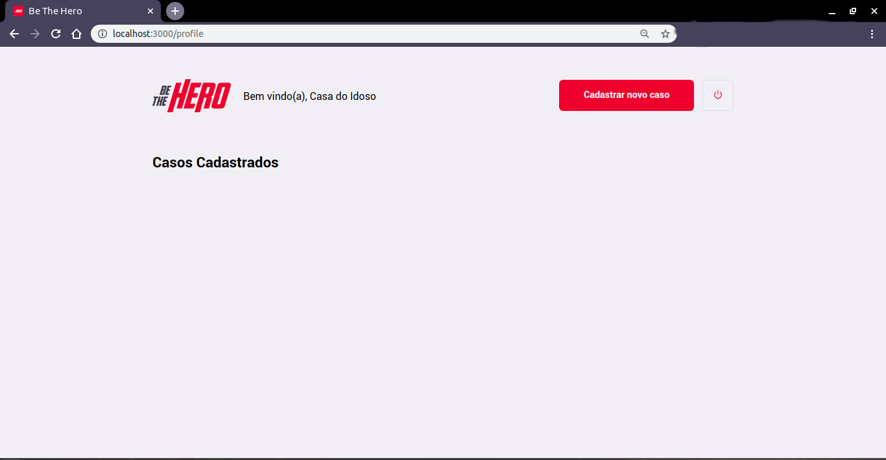

# Be The Hero - 11ª Semana Omnistack - Rocketseat

[![Contributors][contributors-shield]][contributors-url]
[![Forks][forks-shield]][forks-url]
[![Stargazers][stars-shield]][stars-url]
[![Issues][issues-shield]][issues-url]
[![MIT License][license-shield]][license-url]
[![LinkedIn][linkedin-shield]][linkedin-url]

> Keywords: `bethehero`, `reactjs`, `react-native`,`nodejs`, `express`, `expo.io`, `whatsapp`, `e-mail`

<!-- TABLE OF CONTENTS -->
## Sumário

- [Apresentação da Aplicação](#apresentação-da-aplicação)
- [Backend](#backend)
	- [Descrição](#descrição)
	- [Estrutura do Projeto](#estrutura-do-projeto)
	- [Executando o Projeto](#executando-o-projeto)
- [Frontend](#frontend)
	- [Descrição](#descrição-1)
	- [Screenshots](#screenshots)
	- [Estrutura do Projeto](#estrutura-do-projeto-1)
	- [Executando o Projeto](#executando-o-projeto-1)
- [Mobile](#frontend)
	- [Descrição](#descrição-2)
	- [Screenshots](#screenshots-1)
	- [Estrutura do Projeto](#estrutura-do-projeto-1)
	- [Executando o Projeto](#executando-o-projeto-1)
- [Contact](#contact)
- [License](#license)

## Apresentação da Aplicação

Be The Hero é uma aplicação voltada para gerar um impacto social! Seu foco é conectar pessoas que se propõem a ajudar, e que muitas vezes não dispõe de tempo, mas podem ajudar de uma forma monetária,  à Organizações Não Governamentias (ONGs) que muitas vezes precisam de um valor para resolver algum incidente/caso específico (compra de materiais, atividades humanitárias, doações, etc.).

## Backend

[View Code](https://github.com/marcosmapl/semana-omnistack11/tree/master/backend)

### Descrição

O Backend é uma api REST que disponibiliza rotas para inclusão e recuperação de informações de `ONGs` e seus `Incidentes` (casos):

- Foi construída utilizando NodeJS e o framework [Express](https://expressjs.com/pt-br/) implementando a arquitetura REST.
- O padrão [JSON](https://www.json.org/json-pt.html) foi adotado como formato de troca de mensagens entre serviços.
- Temos o [SQLite3](https://www.sqlite.org/index.html) como banco de dados (desenvolvimento e testes).
- O módulo [Knex](http://knexjs.org/) foi usado como query builder e gerenciador de `migrations`.
- Os ids únicos das `ONGS` foi gerado utilizando o módulo [uuid v4](https://github.com/uuidjs/uuid).
- Para gerenciamento de acesso à api utilizamos o módulo [cors](https://github.com/expressjs/cors).
- Para validações de dados nas chamadas a API Backend foi utilizado o middleware [celebrate](https://github.com/arb/celebrate), que encapsula o módulo [joi](https://github.com/hapijs/joi) do framework [happi](https://hapi.dev/), para uso dentro do Express.
- Para os testes unitários foi utilizado o framework [jest](https://jestjs.io/) e para testes das rotas HTTP a biblioteca [supertest](https://github.com/visionmedia/supertest).

### Estrutura do Projeto

<code><pre>
├── [jest.config.js](https://github.com/marcosmapl/semana-omnistack11/blob/master/backend/jest.config.js): arquivo de configuração do framework jest (automação de testes).
├── [knexfile.js](https://github.com/marcosmapl/semana-omnistack11/blob/master/backend/knexfile.js): arquivo de configuração do módulo knex (acesso ao banco de dados).
├── src
│   ├── [app.js](https://github.com/marcosmapl/semana-omnistack11/blob/master/backend/src/app.js): arquivo de configuração do servidor express.
│   ├── controllers
│   │   ├── [IncidentController.js](https://github.com/marcosmapl/semana-omnistack11/blob/master/backend/src/controllers/IncidentController.js): controller de incidentes (index, create e delete).
│   │   ├── [OngController.js](https://github.com/marcosmapl/semana-omnistack11/blob/master/backend/src/controllers/OngController.js): controller de ongs (index, create e delete.
│   │   ├── [ProfileController.js](https://github.com/marcosmapl/semana-omnistack11/blob/master/backend/src/controllers/ProfileController.js): controller do perfil da ong que efetuou logon na aplicação.
│   │   └── [SessionController.js](https://github.com/marcosmapl/semana-omnistack11/blob/master/backend/src/controllers/SessionController.js): controller de autenticação de ongs (logon).
│   ├── database
│   │   ├── [connection.js](https://github.com/marcosmapl/semana-omnistack11/blob/master/backend/src/database/connection.js): arquivo que recupera a conexão com o banco de dados selecionado ([desenvolvimento](https://github.com/marcosmapl/semana-omnistack11/blob/master/backend/src/database/db.sqlite3) ou [teste](https://github.com/marcosmapl/semana-omnistack11/blob/master/backend/src/database/test.sqlite3)).
│   │   ├── [db.sqlite3](https://github.com/marcosmapl/semana-omnistack11/blob/master/backend/src/database/db.sqlite3): banco de dados de desenvolvimento.
│   │   ├── [test.sqlite3](https://github.com/marcosmapl/semana-omnistack11/blob/master/backend/src/database/test.sqlite3): banco de dados de testes.
│   │   ├── migrations
│   │   │   ├── [20200328134142_create_table_ongs.js](https://github.com/marcosmapl/semana-omnistack11/blob/master/backend/src/database/migrations/20200328134142_create_table_ongs.js): migrations da tabela ongs.
│   │   │   └── [20200328135725_create_table_incidents.js](https://github.com/marcosmapl/semana-omnistack11/blob/master/backend/src/database/migrations/20200328135725_create_table_incidents.js): migrations da tabela incidents.
│   │   └── test.sqlite3
│   ├── [routes.js](https://github.com/marcosmapl/semana-omnistack11/blob/master/backend/src/routes.js): arquivo de mapeamento das rotas aos seus respectivos controllers, além de aplicar as validações de dados usando o módulo celebrate.
│   ├── [server.js](https://github.com/marcosmapl/semana-omnistack11/blob/master/backend/src/server.js): ponto de entrada da aplicação (inicia o servidor `app.js`).
│   └── utils
│       └── [generateUUID.js](https://github.com/marcosmapl/semana-omnistack11/blob/master/backend/src/utils/generateUUID.js): função que gera `uuids` para as `ongs`.
└── tests
    ├── integration
    │   └── [ong.spec.js](https://github.com/marcosmapl/semana-omnistack11/blob/master/backend/tests/integration/ong.spec.js): testa a rota de inclusão (create) de ongs. 
    └── unit
        └── [generateUUID.spec.js](https://github.com/marcosmapl/semana-omnistack11/blob/master/backend/tests/unit/generateUUID.spec.js): testa a função que gera de uuids para as ongs.
</pre></code>

### Executando o Projeto

1. Faça o download do Projeto [Backend](https://github.com/marcosmapl/semana-omnistack11/tree/master/backend).
1. Na pasta `backend/` execute o comando:
		npm install
1. Isso irá instalar todas as dependências do projeto.
1. Para executar a aplicação, execute o comando abaixo na pasta `backend/`:

	npm start

E então deve ser exibido algo parecido com:

	> backend@1.0.0 start /home/usuário/.../backend
	> nodemon src/server.js

	[nodemon] 2.0.2
	[nodemon] to restart at any time, enter `rs`
	[nodemon] watching dir(s): *.*
	[nodemon] watching extensions: js,mjs,json
	[nodemon] starting `node src/server.js`

## Frontend

[View Code](https://github.com/marcosmapl/semana-omnistack11/tree/master/frontend)

### Descrição

O Frontend é uma aplicação [ReactJS](https://pt-br.reactjs.org/):

- Utiliza o pacote de ícones [Feather Icons](https://feathericons.com/).
- Para navegação entre páginas foram utilizados os componentes `Link` e `useHistory` do [React-Router-Dom](https://github.com/ReactTraining/react-router).
- Para efetuar chamadas HTTP ao backend utilizou-se o [axios](https://github.com/axios/axios).
- Os dados da sessão de usuário (ONGs) são armazenados diretamente no browser utilizando `localStorage`.
- Valores monetários são formatados utilizando a Classe `Intl` do Javascript.

### Screenshots

<figure>
  
  <figcaption>Screenshot 01 - Tela de Logon</figcaption>
</figure>
<figure>
  
  <figcaption>Screenshot 02 - Tela de Registro de ONG</figcaption>
</figure>
<figure>
  
  <figcaption>Screenshot 03 - Código UUID gerado</figcaption>
</figure>
<figure>
  
  <figcaption>Screenshot 04 - ONG Efetuando Logon</figcaption>
</figure>
<figure>
  
  <figcaption>Screenshot 05 - Tela de Perfil da ONG</figcaption>
</figure>
<figure>
  
  <figcaption>Screenshot 06 - Tela de Cadastro de Incidente</figcaption>
</figure>
<figure>
  
  <figcaption>Screenshot 07 - Listagem de Incidentes</figcaption>
</figure>

### Estrutura do Projeto

- `public/`
	- [favicon.ico](https://github.com/marcosmapl/semana-omnistack11/blob/master/frontend/public/favicon.ico) - Favicon do projeto front end.
	- [index.html](https://github.com/marcosmapl/semana-omnistack11/blob/master/frontend/public/index.html) - Página inicial da aplicação.
- `src/`
	- `assets/`
		- [heroes.png](https://github.com/marcosmapl/semana-omnistack11/blob/master/frontend/src/assets/heroes.png) - Brand da tela principal.
		- [logo.svg](https://github.com/marcosmapl/semana-omnistack11/blob/master/frontend/src/assets/logo.svg) - Logo da tela principal.
	- `pages/`
		- `Logon/`
			- [index.js](https://github.com/marcosmapl/semana-omnistack11/blob/master/frontend/src/pages/Logon/index.js) - Tela de Logon.
			- [styles.css](https://github.com/marcosmapl/semana-omnistack11/blob/master/frontend/src/pages/Logon/styles.css) - Arquivo de estilização da Tela de Logon.
		- `NewIncident/`
			- [index.js](https://github.com/marcosmapl/semana-omnistack11/blob/master/frontend/src/pages/NewIncident/index.js) - Tela de Inclusão de Incidente (Caso).
			- [styles.css](https://github.com/marcosmapl/semana-omnistack11/blob/master/frontend/src/pages/NewIncident/styles.css) - Arquivo de estilização da Tela de Inclusão de Incidente (Caso).
		- `Profile/`
			- [index.js](https://github.com/marcosmapl/semana-omnistack11/blob/master/frontend/src/pages/Profile/index.js) - Tela de Perfil da ONG.
			- [styles.css](https://github.com/marcosmapl/semana-omnistack11/blob/master/frontend/src/pages/Profile/styles.css) - Arquivo de estilização da Tela de Perfil da ONG.
		- `Register/`
			- [index.js](https://github.com/marcosmapl/semana-omnistack11/blob/master/frontend/src/pages/Register/index.js) - Tela de Inclusão da ONG (Cadastro).
			- [styles.css](https://github.com/marcosmapl/semana-omnistack11/blob/master/frontend/src/pages/Register/styles.css) - Arquivo de estilização da Tela de Inclusão da ONG.
	- `services/`
		- [api.js](https://github.com/marcosmapl/semana-omnistack11/blob/master/frontend/src/services/api.js) - Arquivo de configuração da api de acesso ao backend (axios).
	- [App.js](https://github.com/marcosmapl/semana-omnistack11/blob/master/frontend/src/App.js) - Componente principal da aplicação.
	- [global.css](https://github.com/marcosmapl/semana-omnistack11/blob/master/frontend/src/global.css) - Arquivo de estilização global da aplicação.
	- [index.js](https://github.com/marcosmapl/semana-omnistack11/blob/master/frontend/src/index.js) - Arquivo de entrada da aplicação.
	- [routes.js](https://github.com/marcosmapl/semana-omnistack11/blob/master/frontend/src/routes.js) - Arquivo de configuração das Rotas (páginas) da Aplicação.

### Executando o Projeto

1. Faça o download do Projeto [Frontend](https://github.com/marcosmapl/semana-omnistack11/tree/master/frontend).
1. Na pasta `frontend/` execute o comando:
		npm install
1. Isso irá instalar todas as dependências do projeto.
1. Para executar a aplicação, execute o comando abaixo na pasta `frontend/`:

		npm start

1. E então deve ser exibido algo parecido com:

		Compiled with warnings.

		./src/pages/Profile/index.js
	  		Line 44:13:  'response' is assigned a value but never used  no-unused-vars

		Search for the keywords to learn more about each warning.
		To ignore, add // eslint-disable-next-line to the line before.

E a Página de Logon deve ser aberta no seu navegador padrão.

## Mobile

[View Code](https://github.com/marcosmapl/semana-omnistack11/tree/master/mobile)

### Descrição

O Aplicação Mobile foi escrita utilizando [React Native](https://github.com/facebook/react-native):

- Utiliza o pacote de ícones [Feather Icons](https://feathericons.com/).
- Para navegação entre telas foi utilizada a biblioteca [Stack](https://reactnavigation.org/docs/hello-react-navigation/#installing-the-stack-navigator-library) do [React Navigation](https://reactnavigation.org/).
- Agumas informações do sistema operacional foram obtidas utilizando [Expo-Constants](https://docs.expo.io/versions/latest/sdk/constants/).
- Para o envio de e-mails de um Heroi para uma ONG foi utilizado o pacote [MailComposer](https://docs.expo.io/versions/latest/sdk/mail-composer/) do Expo.
- Para o envio de mensagems de um Heroi para uma ONG foi utilizado o componente [Linking](https://reactnative.dev/docs/linking) recebendo o `Deep Link` do Whatsapp.
- Para chamadas a API do Backend foi utilizado, assim como no Frontend, o [axios](https://github.com/axios/axios).
- Para formatação dos valores monetários foi utilizado o pacote [Intl](https://github.com/andyearnshaw/Intl.js).

### Estrutura do Projeto

- `assets/`
	- [icon.png](https://github.com/marcosmapl/semana-omnistack11/blob/master/mobile/assets/icon.png) - Ícone do App.
	- [splash.png](https://github.com/marcosmapl/semana-omnistack11/blob/master/mobile/assets/splash.png) - Splash Screen exibida na inicialização do App.
- `src/`
	- `assets/`
		- [logo.png](https://github.com/marcosmapl/semana-omnistack11/blob/master/mobile/src/assets/logo.png) - Logo do App com densidade normal, utilizado nos cabeçalhos das Telas.
		- [logo@2x.png](https://github.com/marcosmapl/semana-omnistack11/blob/master/mobile/src/assets/logo%402x.png) - Logo do App com densidade x2, utilizado nos cabeçalhos das Telas.
		- [logo@3x.png](https://github.com/marcosmapl/semana-omnistack11/blob/master/mobile/src/assets/logo%403x.png) - Logo do App com densidade x3, utilizado nos cabeçalhos das Telas.
	- `pages/`
		- `Detail/`
			- [index.js](https://github.com/marcosmapl/semana-omnistack11/blob/master/mobile/src/pages/Detail/index.js) - Tela de detalhamento de um Incidente (Caso) escolhido na listagem da Tela Principal.
			- [styles.js](https://github.com/marcosmapl/semana-omnistack11/blob/master/mobile/src/pages/Detail/styles.js) - Arquivo de estilização da Tela de detalhamento de um Incidente (Caso).
		- `Incidents/`
			- [index.js](https://github.com/marcosmapl/semana-omnistack11/blob/master/mobile/src/pages/Incidents/index.js) - Tela Principal (Listagem de Incidentes que precisam de Ajuda).
			- [styles.js](https://github.com/marcosmapl/semana-omnistack11/blob/master/mobile/src/pages/Incidents/styles.js) - Arquivo de estilização da Tela Principal.
	- `services/`
		- [api.js](https://github.com/marcosmapl/semana-omnistack11/blob/master/mobile/src/services/api.js) - Arquivo de configuração do axios para acesso a API Backend.
	- [routes.js](https://github.com/marcosmapl/semana-omnistack11/blob/master/mobile/src/routes.js) - Arquivo de configuração das rotas (Telas) no App.
- [App.js](https://github.com/marcosmapl/semana-omnistack11/blob/master/mobile/App.js) - Arquivo Principal (entrada) do App.
- [app.json](https://github.com/marcosmapl/semana-omnistack11/blob/master/mobile/app.json) - Arquivo de Configurações do App.

## Contact

Marcos Lima [![LinkedIn][linkedin-shield]][linkedin-url]

marcos.lima@icomp.ufam.edu.br

[See my project on GitHub](https://github.com/marcosmapl/algorithms-data-structures/)

## License

- **[GNU General Public License v3.0](https://www.gnu.org/licenses/gpl-3.0.html)** 
- Copyright 2020 © [marcosmapl](https://github.com/marcosmapl).

<!-- Markdown link & img dfn's -->
[wiki]: https://github.com/marcosmapl/semana-omnistack11/wiki
[linkedin-shield]: https://img.shields.io/badge/-LinkedIn-black.svg?style=flat-square&logo=linkedin&colorB=555
[linkedin-url]: https://linkedin.com/in/marcosmapl
[contributors-shield]: https://img.shields.io/github/contributors/marcosmapl/semana-omnistack11.svg?style=flat-square
[contributors-url]: https://github.com/marcosmapl/semana-omnistack11/graphs/contributors
[forks-shield]: https://img.shields.io/github/forks/marcosmapl/semana-omnistack11.svg?style=flat-square
[forks-url]: https://github.com/marcosmapl/semana-omnistack11/network/members
[stars-shield]: https://img.shields.io/github/stars/marcosmapl/semana-omnistack11.svg?style=flat-square
[stars-url]: https://github.com/marcosmapl/semana-omnistack11/stargazers
[issues-shield]: https://img.shields.io/github/issues/marcosmapl/semana-omnistack11.svg?style=flat-square
[issues-url]: https://github.com/marcosmapl/semana-omnistack11/issues
[license-shield]: https://img.shields.io/github/license/marcosmapl/semana-omnistack11.svg?style=flat-square
[license-url]: https://github.com/marcosmapl/semana-omnistack11/blob/master/LICENSE
